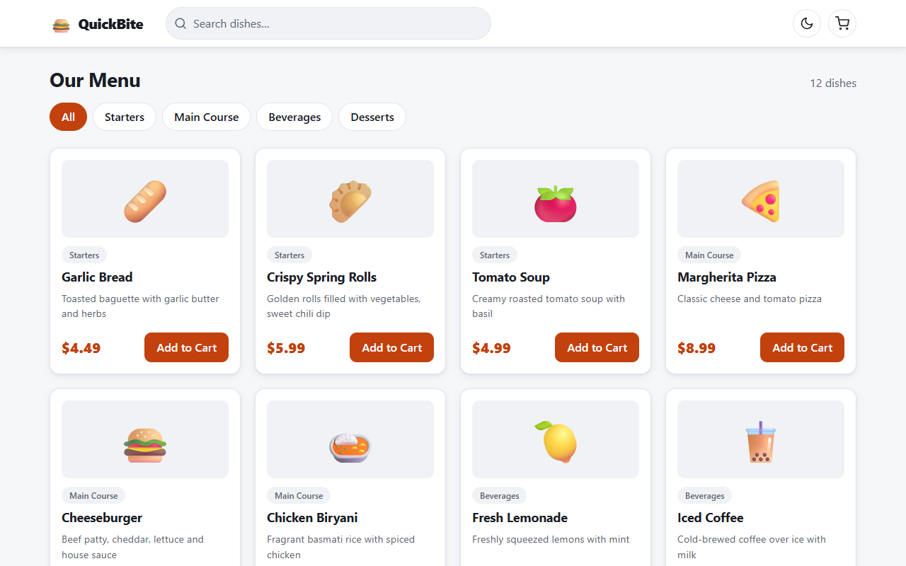
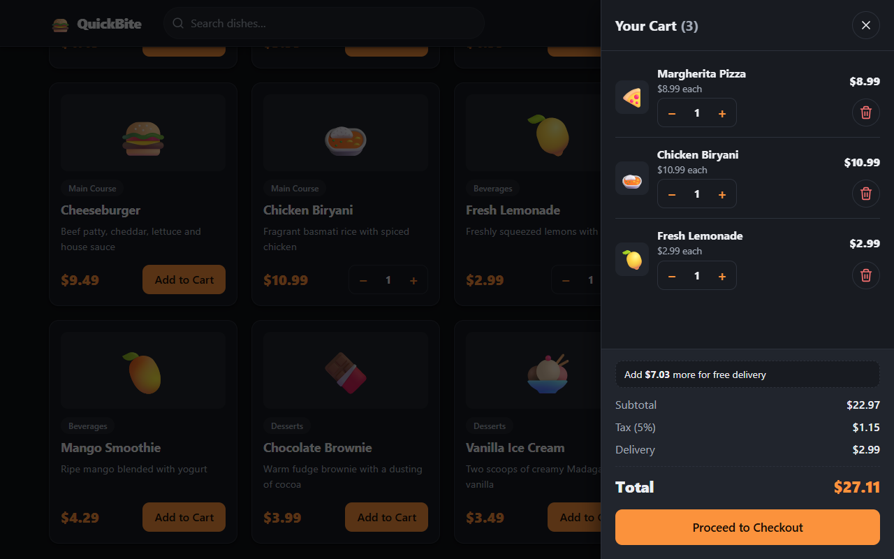
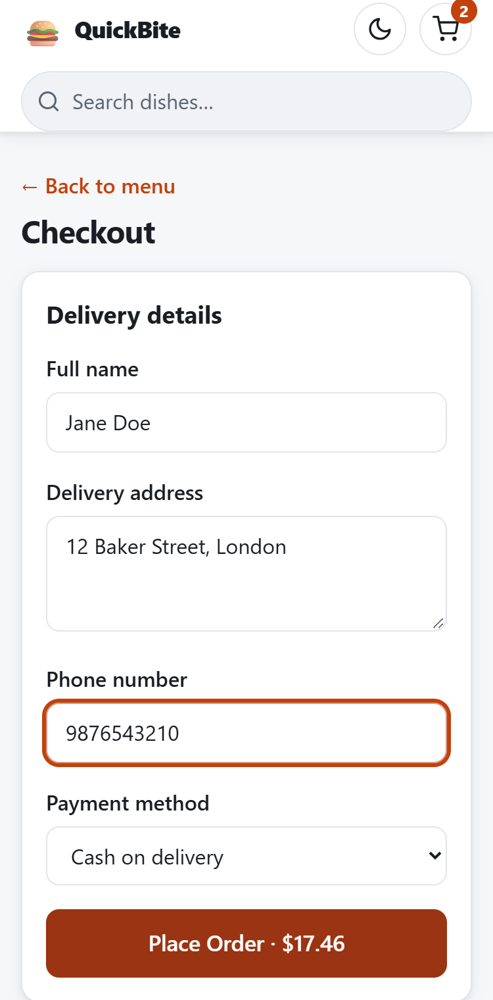

# QuickBite: Food Order App

A single-page food ordering web app. Browse a menu, build a cart, check out, and get an order confirmation, in light or dark mode, on desktop or mobile.

It is one self-contained file written in vanilla HTML, CSS and JavaScript. There is no build step, no dependencies, no backend and no internet connection needed.

| Menu (light) | Cart (dark) | Checkout (mobile) |
|---|---|---|
|  |  |  |

**Live demo: https://rishalbridgeon.github.io/food-order-app/**

## Run it locally

Download or clone the repo and open `index.html` in any modern browser. That's it.

```bash
git clone https://github.com/rishalbridgeon/food-order-app.git
cd food-order-app
# then open index.html (double-click it, or drag it into a browser)
```

## Features

- **Menu:** 12 dishes across 4 categories (Starters, Main Course, Beverages, Desserts). Filter by category and search by name; the two combine.
- **Cart drawer:** slides in from the right. Each line has +/− controls, a line subtotal and a remove button. The header badge shows the live item count, and an empty cart shows a friendly empty state.
- **Quantity controls** on both the menu cards and in the cart. Going below 1 removes the item.
- **Order summary:** subtotal, 5% tax, and a $2.99 delivery fee that is free from $30. It updates live, and a hint shows how much more you need for free delivery.
- **Checkout:** name, address, phone and payment method (Cash / Card / UPI), with inline validation and the first invalid field focused.
- **Confirmation:** order ID, items, total paid, payment method, delivery address and an estimated delivery time. The cart resets afterwards.
- **Light and dark themes:** toggle from any screen. It starts from your OS setting.
- **Responsive:** tested from 1440px down to 320px wide, with no horizontal scroll.
- **Accessible:** keyboard-operable (Tab, Enter, Space, Esc), focus trapped inside the open cart, focus returned when it closes, visible focus outlines, labelled controls, screen-reader announcements for the toast, and reduced-motion support.

## How it works

State lives in a few in-memory variables, and every change re-renders the screen from that state.

```
click  →  change state (cart, filters, view)  →  render from state
```

- **Cart** is stored as `[{ id, quantity }]`. Names and prices are always looked up from the `MENU` array, so there is a single source of truth.
- **Money** is summed in whole cents (tax rounded once), so the rows you see always add up to the total you see. This avoids floating-point errors such as `26.970000000000002`.
- **Theming** uses CSS custom properties defined once for light and once for `[data-theme="dark"]`. No component hard-codes a colour.
- **One click listener** handles every button through `data-action` attributes (event delegation), so it keeps working when the cart re-renders.
- **User-typed text is escaped** before it is shown, so a name like `<b>x</b>` appears as text rather than being run as HTML.
- **No external assets:** food images are emojis and the font is the system font stack.

## Project files

| File | Purpose |
|---|---|
| `index.html` | The whole app (HTML, CSS and JS) |
| `Food_Order_App_PRD.md` | The product requirements the app was built from |
| `tasks.md` | The phase-by-phase execution plan (Phases 0–8), with checkpoints |
| `screenshots/` | Images used in this README |

## Limitations

- State is in memory only, so refreshing the page empties the cart.
- There is no real payment, login, backend or order tracking. These were out of scope in the PRD.
- I tested it in Chrome (light and dark, four viewport widths) and did not test Firefox, Safari or a screen reader.

## Ideas for next steps

- Save the cart to `localStorage`.
- Load the menu from an API and post orders to a backend.
- Coupon codes and a favourites list.
- Add the browser tests to the repo and run them in CI.
